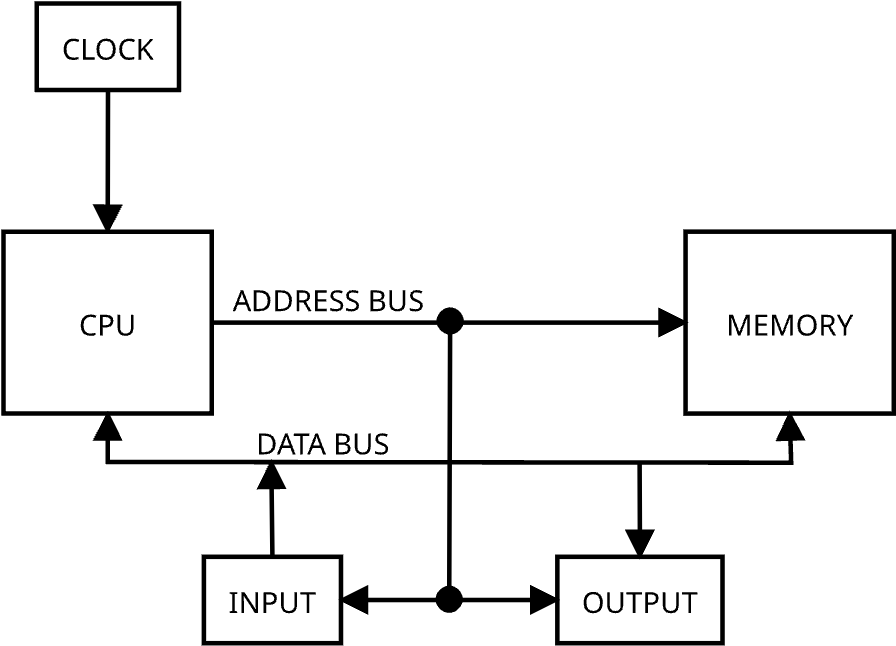

# [Altair Manual Part 2](https://ubuntourist.codeberg.page/Altair-8800/part-2.html)

Diagram of the internals of the Altair 8800:

## A. CENTRAL PROCESSING UNIT

-   The CPU is the heart of the computer. The Altair 8800 uses the Intel 8080 chip.
-   Parts of the CPU:

    | Part                 | Function                                                                                                                                                    |
    | -------------------- | ----------------------------------------------------------------------------------------------------------------------------------------------------------- |
    | Timing And Control   | Receives and distributes clock signal                                                                                                                       |
    | Instruction Register | Holds the instruction being executed                                                                                                                        |
    | Arithmetic           | Performs binary and decimal arithmetic via addition. Even multiplication is just repeated addition.                                                         |
    | Registers            | CPU has seven 8-bit registers. They are used to store data and addresses. The accumulator register is a special register that is the primary storage point. |
    | Status bit register  | Special purpose register which holds status on the CPU - e.g. carry bit, aux carry bit, sign bit, zero bit, and the parity bit                              |
    | Program counter      | Special 16 bit register that holds the address of the next instruction to be executed                                                                       |
    | Stack pointer        | Special 16 bit register that holds the address of the top of the stack                                                                                      |

## B. MEMORY

-   External to the CPU. 65,536 bytes of memory. Each address is specified with two bytes.
-   Data stored in RAM is exchanged to and from the CPU with 8 data lines called the Data Bus.
    -   This allows data to be sent to and from the CPU in 8 bit chunks.

## C. CLOCK

-   2 MHz clock speed
-   Crystal controlled

## D. INPUT/OUTPUT

-   Many devices can be connected to the Altair 8800
-   The CPU communicates with the devices via the Input/Output Bus
-   Programs can use interrupts to communicate with devices
-   Up to 256 input and 256 output devices can be connected to the Altair 8800
